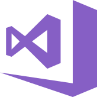

# Hi, I'm Ridhwan 👋  
🎓 Diploma in Computer Science @ UiTM | 💻 Passionate about coding, web dev, and problem-solving  

---

## 👨‍💻 About Me
- 🌱 Currently learning **web development** and exploring **AI/ML**  
- 🔧 Experienced in **C++, Java, Python, and full-stack development**  
- 🎯 Goal: Build impactful projects and contribute to open-source  
- ⚡ Fun fact: I enjoy solving puzzles & playing survival shooter games  

---

## 🛠️ Languages and Tools  

  
  
  
  
  

  
  
  
  
  

  
  
  
  
  

  
  
  

---

## 📊 GitHub Stats  

  
  

  

---

## 🚀 Featured Projects  

- 🎾 [EaseSportRentals](https://github.com/RidhwanHazian/EaseSportRentals) – Sports rental system in C  
- ☁️ [WeatherApp](https://github.com/RidhwanHazian/WeatherApp) – MIT App Inventor weather app with dynamic UI  
- ⛺ [TasikBiruCamps](https://github.com/RidhwanHazian/camp) – Booking system using XAMPP & MySQL  
- 🎮 [RidhwanGame](https://github.com/RidhwanHazian/RidhwanGame) – A 2D browser-based survival shooting game    ▶ [Play Live](https://ridhwanhazian.github.io/RidhwanGame/)  
- ❓ [QuizApp](https://github.com/RidhwanHazian/QuizApp) – Web-based multiple-choice quiz built with HTML, CSS, and JS    ▶ [Try Quiz](https://ridhwanhazian.github.io/QuizApp/)  
- 🚗 [GrabStudent](https://github.com/RidhwanHazian/GrabStudent) – Web-based Grab booking platform with dashboards for Customers, Drivers, and Admins  

---

## 🌐 Connect with Me  

  
  
  

---

## 🎵 Just Vibin’  

  

